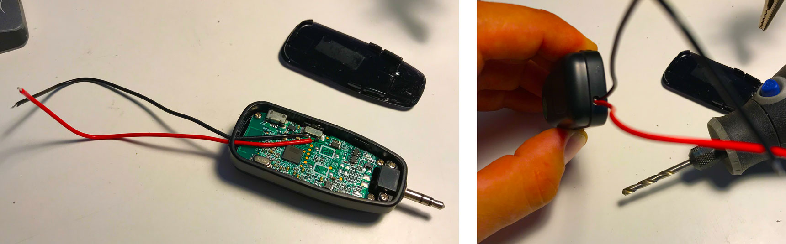

# Hardware hack voor microfoon

Hardware hack om een draadloze microfoon te bedienen met een grote knop in een heuptas.

De hele set-up gaat er voor zorgen dat je op een smartphone een externe micro én een luidspreker kan aansluiten via de koptelefoon ingang. _Voor de nieuwere iphones heb je het [adaptor tussenstuk](https://www.apple.com/be-nl/shop/product/MMX62ZM/A/lightning-naar-35%E2%80%91mm-koptelefoonaansluiting-adapter) nodig._

## Beetje achtergrondinformatie over jacks

De hoofdtelefoon ingang van een smartphone is van het [type 3,5mm 'jack'](https://nl.wikipedia.org/wiki/Klink_(stopcontact)), ook wel mini-jack genoemd. Een stereo hoofdtelefoon heeft drie ringen of polen, een headset voor een smartphone waar ook een micro bij zit, heeft vier ringen.

Via deze ene stekker gaat dus zowel het geluid van de microfoon naar de smartphone als van de smartphone naar de oortjes.

Om nu een aparte micro en een aparte luidspreker aan te sluiten, hebben we een splitter nodig. Via deze kabel wordt de micro en luidspreker van elkaar gescheiden.

## Onderdelen in de oplossing van Tom

### Materialen voor micro en luidspreker op smartphone aan te sluiten
- Heuptas. [deze](https://www.amazon.com/gp/product/B074BRTNDD/ref=oh_aui_detailpage_o06_s01) had genoeg plaats en compartimenten voor alle onderdelen.
- Luidspreker op batterijen: [deze werd gebruikt](https://www.amazon.de/gp/product/B0721W7CTT/ref=oh_aui_detailpage_o02_s00) De micro die hierbij zit, zou ook kunnen gebruikt worden, maar voor Tom was de draad een extra hinderpaal.
- Audio splitter cable. Overal te krijgen, ook in China via deze [link](https://nl.aliexpress.com/item/New-3-5mm-Stereo-Headphone-Microphone-Audio-Y-Splitter-Cable-Adapter-Plug-Jack-Cord/32391434939.html)
- Korte stereo audio kabel. Neem er best een waarbij één van de twee stekkers in een hoek staat. Zo één als [deze](images/audio-kabel.jpg) bijvoorbeeld.
- Draadloze microfoon: Deze [relatief goedkope](https://de.aliexpress.com/item/2-4G-Wireless-Mikrofon-Lautsprecher-40-mt-bertragung-Dual-Ohr-Headset-Megaphon-Radio-Mic-F-r/32877216169.html) werd gebruikt voor Tom.

### Knop voor Tom + aansturing
- [button met ingebouwde led](https://www.adafruit.com/product/1192)
- [adafruit gemma](https://www.adafruit.com/product/1222)
- stukje prototype pcb
- draadjes
- npn-transistor
- 1k weerstand
- Kleine schuifschakelaar
- battery pack (met 3.3v lipo battery)
- 3D printed button houder: [ontwerp staat hier](designs/button-holder.stl)

## Aansluitingen

Een eenvoudige manier om de mcirofoon aan en uit te zetten is om de schakelaar in de ontvanger te gaan aansturen via een transistor die op zijn beurt via een arduino aangestuurd wordt.

Mocht er een grote knop bestaan die ingedrukt bleef, dan hadden we de arduino niet nodig, maar deze hebben we sîjtig genoeg niet gevonden.

### draadloze ontvanger

De ontvanger gaat gemakkelijk open. Je kan de pcb er ook eenvoudig uithalen om er voorzichtig twee draadjes op te solderen op de plaatsen waar de schakelaar op de printplaat vast zit.

Met een dremel boor je een gat in de behuizing. Daarna kan je alles voorzichtig terug in elkaar steken.

Je kan het testen door de twee draadjes met elkaar te verbinden. Hierdoor zet je de ontvanger aan (er gaat een klein blauw ledje knipperen).

### Knop

De led in de knop heeft een weerstand en is voorzien voor 5v. We gaan werken op 3.3v dus moeten we deze vervangen (of weglaten).

Je kan de knop voorzichtig open doen. De windingen van de voetjes van de led wegdraaien en de weerstand los solderen. Onthou best even de richting zodat je de led met de juiste polariteit kan terugsteken.

### batterij

Om de gemma en de knop te voeden hebben we stroom nodig. Een eerste poging om af te tappen van de luidspreker leverde heel veel gebrom op in het geluid aangezien de stroomkringen niet gescheiden waren. Pogingen met optcouplers leverden niet veel verbetering op, dus werd gekozen voor een goedkope externe batterij in een batterypack.  

Maar aangezien de meeste batterypacks automatisch uitgaan als ze niet genoeg stroom trekken, moesten we deze hacken. In de meeste battery packs van 5v, zit een lipo batterij van 3.3v, ideaal dus om die rechtstreeks aan te sluiten.

Op deze manier kan het laadcircuit nog steeds gebruikt worden en hebben we constant 3.3v.

### Gemma

Uploade de [code voor de arduino](button/button.ino) en soldeer de schakelingen en sluit de knop en batterij aan.

### Houder

In de houder ([stl-file](designs/button-holder.stl)) kan je de knop en schuifschakelaar kwijt.

## Assemblage in de tas

- De ontvanger van de draadloze micro gaat in de rode aansluiting van de splitterkabel.
- De stereo audio kabel gaat tussen de groene aansluiting van de splitter en de luidspreker.
- De splitter gaat in de headphone aansluiting van de smartphone

Je kan alles testen met een voice-recording app op je smartphone.

Het is een beetje zoeken om alles proper in de tas te krijgen, maar op deze manier heb je een draagbare oplossing om een micro en luidspreker aan te sluiten op een smartphone en met een knop deze te activeren.

